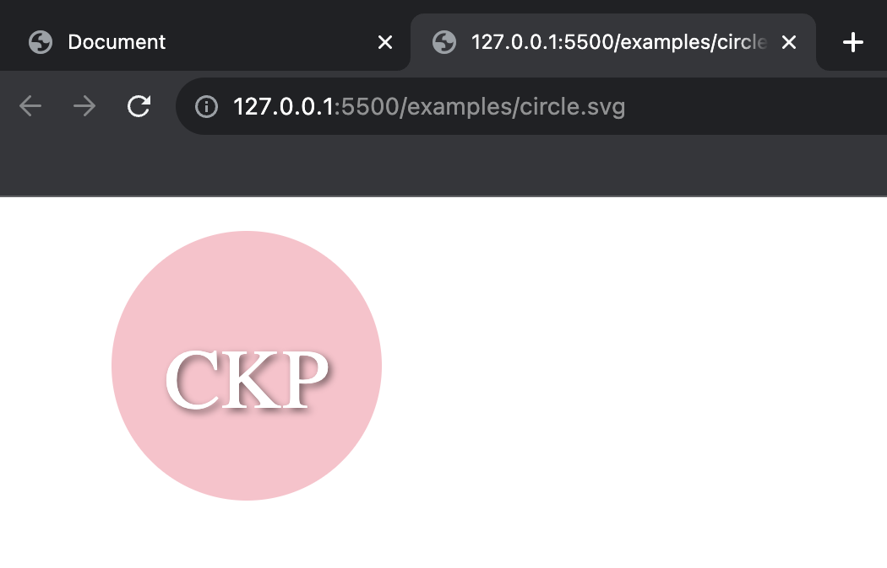

# svg-logo-generator

this application will assist in making an svg file logo

## Description

This is a command line application that receives user input and creates a logo that is saved as an SVG. User will be prompted for text, text color, shape color, and shape design.

## Installation

The user must install the npm packages. Please ensure you are not using a version of inquirer above 9.0.0, or the command will not work. To generate the SVG logo run "node index.js" in your terminal.

## Usage

Video Walkthrough: https://drive.google.com/file/d/1DtF5dAsLNeIOv7DRqDwrhAVzoonCEjar/view

## License

MIT license

## Tests

To run test enter "npm test" in terminal

## Questions

email: chelseakathrynp@gmail.com
github: (https://github.com/callmechelsea)
